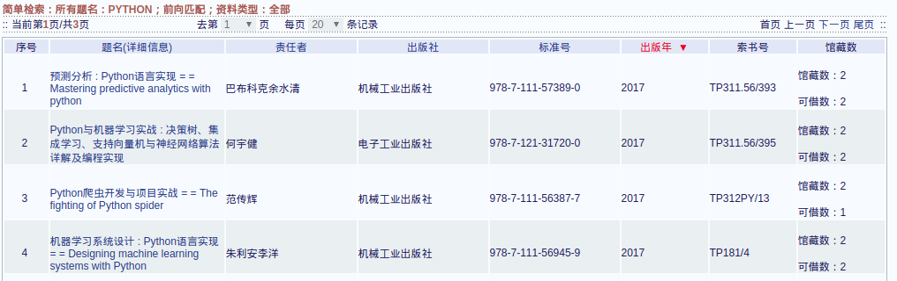
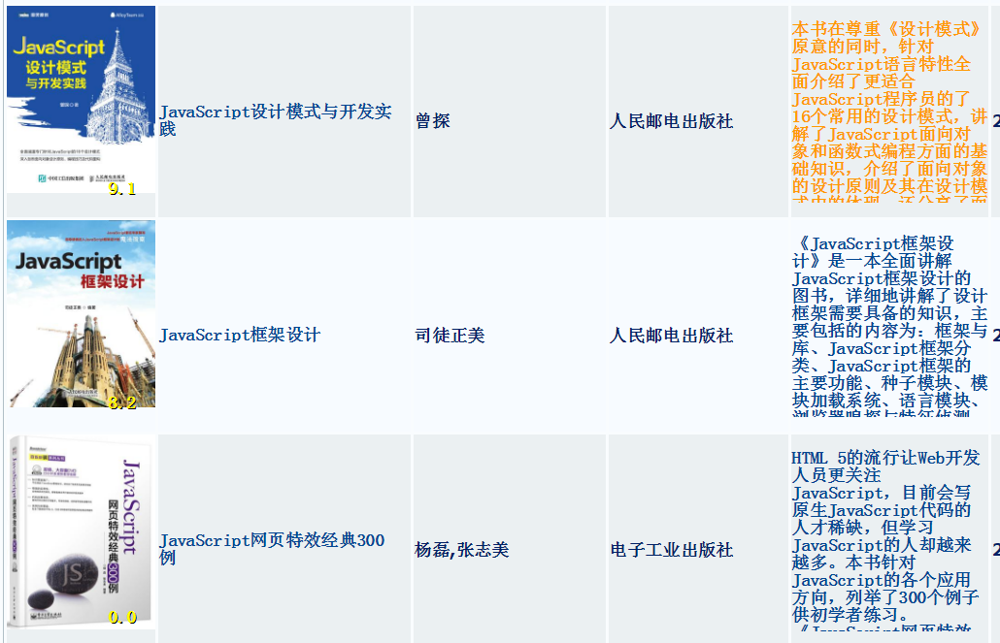

# BuctLibCrx
北化图书馆助手 Chrome 插件

### 功能:
为[北化图书馆官网](http://lib.buct.edu.cn) 图书检索结果自动增加豆瓣图片，豆瓣评分以及豆瓣的简介

### 效果：
#### Before
 

#### After
 

### 环境：
> 支持 Chrome 及 Chromium内核的浏览器（猎豹，搜狗，360）

### 使用方法：
1. 地址栏输入 `chrome://extensions/`
1. 点击`开发者模式`
1. 点击`加载已解压的扩展程序`
1. 找到并选中`BuctLibCrx`文件夹
1. 在`http://lib.buct.edu.cn`中进行测试

> 更多帮助 请搜索关键字`Chrome 插件 开发者模式`

### 注意事项

豆瓣 限制了单ip每小时只能访问150次

一小时内 搜索过多次 会导致豆瓣的信息无法加载
